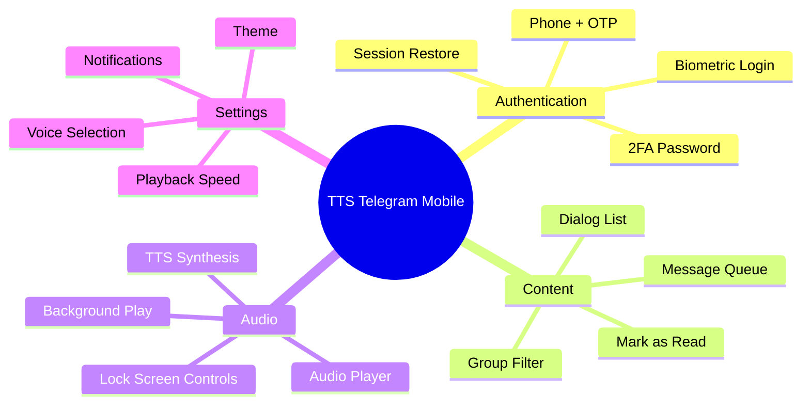

# Mobile Features - TTS Telegram Reader

> **Chi tiết tính năng cho ứng dụng mobile React Native**

---

## Tổng Quan Tính Năng



---

## Core Features (MVP)

### F01: Telegram Login

**Mô tả:** Đăng nhập vào tài khoản Telegram cá nhân bằng số điện thoại và mã OTP.

**Acceptance Criteria:**
- [ ] User nhập số điện thoại (format quốc tế: +84...)
- [ ] Gửi mã OTP về Telegram app hoặc SMS
- [ ] Nhập mã OTP (5-6 số)
- [ ] Nếu có 2FA → hiển thị form nhập password
- [ ] Sau khi thành công → chuyển đến màn hình chính

**Technical Notes:**
- API: `POST /api/auth/send-code`, `POST /api/auth/sign-in`
- Error handling: Invalid phone, wrong code, 2FA required

**UI Interactions:**
```
┌─────────────────────────────────────┐
│                                     │
│        📱 TTS Telegram              │
│                                     │
│   ┌─────────────────────────────┐   │
│   │ +84 │ 376 340 112           │   │
│   └─────────────────────────────┘   │
│                                     │
│   [     Gửi Mã Xác Thực     ]      │
│                                     │
│   Nhập số điện thoại Telegram       │
│   của bạn để đăng nhập              │
│                                     │
└─────────────────────────────────────┘
```

---

### F02: Session Persistence

**Mô tả:** Lưu session để user không cần đăng nhập lại mỗi lần mở app.

**Acceptance Criteria:**
- [ ] Session token lưu trong Secure Store sau khi login
- [ ] Mở app → tự động check và restore session
- [ ] Hiển thị loading indicator khi restoring
- [ ] Nếu session expired → redirect về login
- [ ] Có option "Logout" để clear session

**Technical Notes:**
- Storage: `expo-secure-store` (Keychain iOS / Keystore Android)
- API: `POST /api/auth/restore`

---

### F03: Dialog List (Groups/Channels)

**Mô tả:** Hiển thị danh sách tất cả groups và channels từ tài khoản Telegram.

**Acceptance Criteria:**
- [ ] Load danh sách dialogs sau khi login
- [ ] Hiển thị: Title, type (group/channel), unread count
- [ ] Pull-to-refresh để reload
- [ ] Loading skeleton khi đang fetch
- [ ] Empty state khi không có groups

**UI Requirements:**
- Unread badge: Hiển thị số tin chưa đọc (đậm màu nếu > 0)
- Icon: Phân biệt group vs channel
- Touch target: ≥ 48dp

**Technical Notes:**
- API: `GET /api/dialogs`
- Cache với react-query (staleTime: 30s)

---

### F04: Group Selection

**Mô tả:** Cho phép user chọn một hoặc nhiều groups để đọc.

**Acceptance Criteria:**
- [ ] Tap vào item → toggle selection (checkbox)
- [ ] Multi-select mode
- [ ] "Select All" và "Clear All" buttons
- [ ] Selected count hiển thị
- [ ] Nút "Bắt Đầu Đọc" khi có selection

**Technical Notes:**
- State: `selectedDialogIds[]` trong Zustand store
- Persist selection trong AsyncStorage

---

### F05: Message Queue

**Mô tả:** Tạo queue các tin nhắn chưa đọc từ groups đã chọn.

**Acceptance Criteria:**
- [ ] Fetch messages từ selected groups
- [ ] Sort theo thời gian (cũ → mới)
- [ ] Hiển thị queue với status (pending/playing/completed)
- [ ] Now Playing: Highlight item đang phát
- [ ] Upcoming: Danh sách sắp phát

**Technical Notes:**
- API: `GET /api/messages/:dialogId`
- Queue structure: `QueueItem[]` với status tracking

---

### F06: Audio Player

**Mô tả:** Player controls để điều khiển phát audio TTS.

**Acceptance Criteria:**
- [ ] Play/Pause toggle button (large, easy to tap)
- [ ] Skip Next / Skip Previous
- [ ] Progress bar với seek capability
- [ ] Current time / Duration display
- [ ] Loading indicator khi generating TTS

**UI Layout:**
```
┌─────────────────────────────────────┐
│ Now Playing                         │
│ ┌─────────────────────────────────┐ │
│ │ Group: Tech News                │ │
│ │ "Breaking: New AI model..."     │ │
│ │ 👤 John Doe • 10:30 AM          │ │
│ └─────────────────────────────────┘ │
│                                     │
│    ●━━━━━━━━━━━━━━━━━━━━━○         │
│    0:45                    2:30     │
│                                     │
│      ⏮️     ▶️/⏸️     ⏭️           │
│                                     │
└─────────────────────────────────────┘
```

**Technical Notes:**
- Library: `expo-av` hoặc `react-native-track-player`
- Native controls integration

---

### F07: TTS Synthesis

**Mô tả:** Gọi API để chuyển đổi text thành audio.

**Acceptance Criteria:**
- [ ] Gọi synthesize API với message text
- [ ] Support multiple providers (Google, OpenAI, Google Cloud)
- [ ] Stream audio từ server
- [ ] Handle errors gracefully
- [ ] Retry option khi fail

**Technical Notes:**
- API: `POST /api/tts/synthesize`, `GET /api/tts/stream/:id`
- Request body: `{ text, provider, voice }`

---

### F08: Background Audio

**Mô tả:** Tiếp tục phát audio khi app ở background hoặc screen locked.

**Acceptance Criteria:**
- [ ] Audio không bị ngắt khi switch app
- [ ] Audio tiếp tục khi lock screen
- [ ] Auto-play next item trong background
- [ ] Tối ưu battery consumption

**Technical Notes:**
- iOS: `audio` background mode
- Android: Foreground service
- Library: `react-native-track-player` (recommended for background)

---

### F09: Auto-Play Queue

**Mô tả:** Tự động chuyển sang tin nhắn tiếp theo khi tin hiện tại kết thúc.

**Acceptance Criteria:**
- [ ] Khi audio end → tự động play next
- [ ] Pre-generate audio cho next item
- [ ] Stop khi hết queue (hoặc loop option)
- [ ] Notification khi queue completed

**Technical Notes:**
- Logic trong Zustand store action `nextInQueue()`
- Pre-fetch 1-2 items ahead

---

## Should Have Features

### F10: Voice Selection

**Mô tả:** Cho phép user chọn giọng đọc từ các TTS providers.

**Acceptance Criteria:**
- [ ] Danh sách voices từ API
- [ ] Group by provider (Google, OpenAI, Google Cloud)
- [ ] Gender indicator (Male/Female/Neutral)
- [ ] Preview voice button
- [ ] "Random voice" toggle

**Technical Notes:**
- API: `GET /api/tts/voices`
- Persist selection trong store

---

### F11: Playback Speed Control

**Mô tả:** Điều chỉnh tốc độ phát audio.

**Acceptance Criteria:**
- [ ] Speed options: 0.5x, 0.75x, 1x, 1.25x, 1.5x, 2x
- [ ] Persist setting
- [ ] Real-time change (không cần restart audio)

---

### F12: Theme Selection

**Mô tả:** Chọn theme màu sắc cho app.

**Themes:**
| Theme | Primary | Background |
|-------|---------|------------|
| Ocean Calm | Teal | Dark navy |
| Midnight Audio | Purple | Dark |
| Fintech Trust | Royal blue | Clean white |
| Terminal Green | Green | Pure black |

---

### F13: Mark as Read Sync

**Mô tả:** Đồng bộ trạng thái đã đọc về Telegram.

**Acceptance Criteria:**
- [ ] Sau khi phát xong → gọi API mark as read
- [ ] Update unread count realtime
- [ ] Fire-and-forget (không block UI)

**Technical Notes:**
- API: `POST /api/messages/:dialogId/read`

---

### F14: Group Sorting

**Mô tả:** Sắp xếp danh sách groups theo tiêu chí.

**Sort Options:**
- By time (mới nhất trước)
- By unread count (nhiều nhất trước)

---

### F15: Lock Screen Controls

**Mô tả:** Điều khiển phát từ lock screen và notification center.

**Acceptance Criteria:**
- [ ] Play/Pause button
- [ ] Next/Previous buttons
- [ ] Now playing info display
- [ ] Album art placeholder

**Technical Notes:**
- iOS: `MPRemoteCommandCenter`
- Android: MediaSession + Notification

---

## Mở Rộng Đề Xuất (Mobile-Specific)

> **Các tính năng mới chỉ có trên mobile, không có trên web:**

### F30: 🆕 Swipe Gestures

**Mô tả:** Điều khiển bằng gesture khi hands-free.

**Gestures:**
| Gesture | Action |
|---------|--------|
| Swipe Right | Next message |
| Swipe Left | Previous message |
| Long Press | Pause/Resume |
| Double Tap | Toggle speed |

---

### F31: 🆕 Auto-Start Mode

**Mô tả:** Mở app → tự động bắt đầu đọc từ groups đã lưu.

**Acceptance Criteria:**
- [ ] Option trong Settings: "Auto-start on open"
- [ ] Sử dụng saved group selection
- [ ] Skip login (nếu session valid)

---

### F32: 🆕 Sleep Timer

**Mô tả:** Tự động dừng sau một khoảng thời gian.

**Options:**
- 15 phút
- 30 phút
- 1 giờ
- End of queue

---

### F33: 🆕 Quick Actions (iOS 3D Touch / Android Shortcuts)

**Mô tả:** Home screen shortcuts để truy cập nhanh.

**Actions:**
- "Start Listening" - Mở và bắt đầu phát
- "Favorite Groups" - Đến groups yêu thích

---

### F34: 🆕 Haptic Feedback

**Mô tả:** Phản hồi rung khi tương tác.

**Triggers:**
- Tap Play/Pause
- Complete/Skip message
- Error notification

---

## Feature Priority Matrix

```
           ┌─────────────────────────────────────────┐
  HIGH     │ F01 Login    F06 Player    F08 Bg Audio│
 IMPACT    │ F02 Session  F05 Queue     F09 Autoplay│
           ├─────────────────────────────────────────┤
  MEDIUM   │ F03 Dialogs  F10 Voice     F15 Lock Scr│
 IMPACT    │ F04 Select   F11 Speed     F30 Gestures│
           ├─────────────────────────────────────────┤
  LOW      │ F12 Theme    F32 Sleep     F33 Shortcuts│
 IMPACT    │ F14 Sort     F34 Haptic                │
           └─────────────────────────────────────────┘
                 MVP          Should Have    Nice to Have
                ─────────────────────────────────────────>
                              EFFORT
```

---

## Acceptance Test Plan

### Authentication Flow
1. Fresh install → show Login screen
2. Enter phone → receive OTP
3. Enter OTP → login success
4. Close app, reopen → auto-restore session
5. Logout → clear session, show Login

### Playback Flow
1. Select 2-3 groups
2. Tap "Start Reading"
3. Audio plays automatically
4. Lock screen → audio continues
5. Next message auto-plays
6. Complete queue → notification

### Edge Cases
- Network loss mid-playback → graceful pause
- Invalid session → redirect login
- Empty groups → empty state UI
- TTS error → skip and continue

---

> **Tài liệu liên quan:**
> - [mobile-requirements.md](./mobile-requirements.md)
> - [mobile-ui-screens.md](./mobile-ui-screens.md)
> - [mobile-architecture.md](./mobile-architecture.md)
